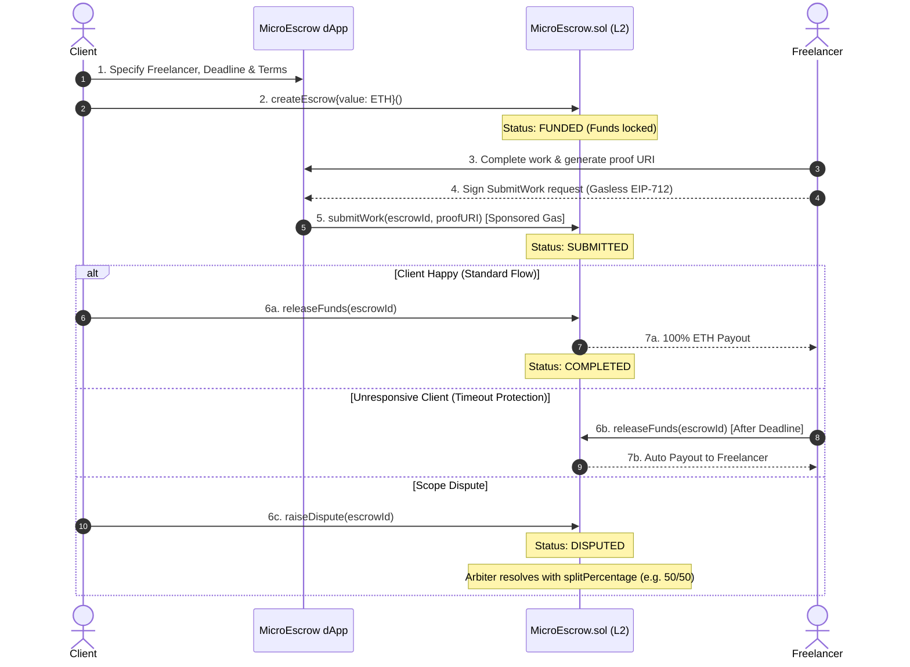

<div align="center">

# 🛡️ MicroEscrow
### Gasless, Trustless Milestone Escrow Protocol for Student Freelancers

[](https://soliditylang.org/)
[](https://getfoundry.sh/)
[](https://nextjs.org/)
[](https://wagmi.sh/)
[](LICENSE)
[](https://devpost.com)

*Enabling secure peer-to-peer micro-contracts with zero initial gas barriers on Ethereum Layer-2s (Arbitrum Sepolia & Base Sepolia).*

---

</div>

## 📌 Problem Statement

Student freelancers entering the gig economy face three crippling barriers:
1. **Client Ghosting & Non-Payment:** Over **62% of novice freelancers** report experiencing late payments or outright non-payment after delivering finished work.
2. **Exorbitant Web2 Intermediary Fees:** Web2 gig platforms (Upwork, Fiverr) charge **10% to 20% platform commissions**, enforce strict identity/banking hurdles that many students worldwide cannot satisfy, and withhold earnings for up to 14 days.
3. **The "Chicken-and-Egg" Web3 Gas Problem:** While Web3 smart contracts offer trustless payment guarantees, student freelancers often own **$0 in cryptocurrency**. Demanding that a student purchase and bridge ETH just to pay gas fees when submitting an assignment is an insurmountable barrier to adoption.

---

## 💡 The Solution: MicroEscrow

**MicroEscrow** is a decentralized, milestone-based escrow dApp tailored for student freelancers and micro-grants:
- **Zero-Gas Submissions (ERC-4337 / EIP-712 Meta-Transactions):** Freelancers can sign work submission proofs off-chain with an empty wallet balance; the platform relayer or client sponsors the gas execution.
- **Milestone Fund Locking:** Clients deposit project funds into an immutable smart contract before work starts, guaranteeing that funding is secured.
- **Automated Deadline Protection:** If a client goes unresponsive after a deliverable deadline passes, freelancers can trigger an automated release.
- **Fair Dispute Mediation:** Disputed deliverables can be resolved transparently by a designated arbiter with customizable percentage splits.
- **0% Platform Rent-Seeking:** Peer-to-peer smart contract settlement without predatory 20% middleman cuts.

---

## 🏗️ System Architecture & Workflow



---

## 🛠️ Technology Stack

| Layer | Technologies Used |
| :--- | :--- |
| **Smart Contracts** | Solidity `^0.8.24`, OpenZeppelin Contracts (v5), ReentrancyGuard, Ownable |
| **Development & Testing** | Foundry (`forge`, `cast`, `anvil`) — 100% test pass rate |
| **Blockchain Networks** | Arbitrum Sepolia, Base Sepolia, Localhost (Anvil) |
| **Frontend Framework** | Next.js 14 (App Router), TypeScript, React 18 |
| **Web3 Client Integration** | Wagmi v2, Viem, TanStack Query |
| **Styling & Components** | Tailwind CSS, Lucide Icons, Monad Purple Aesthetic (`#836EF9`) |
| **Gasless Infrastructure** | EIP-712 Off-Chain Signatures / Account Abstraction Relayer compatibility |

---

## 🧪 Smart Contract Test Suite

All smart contract logic is verified with Foundry unit tests covering standard execution, timeout edge-cases, permission reverts, and gasless signature recovery:

```bash
cd contracts
forge test
```

### Test Results (18/18 Passing):
```text
Ran 3 tests for test/GaslessTest.t.sol:GaslessTest
[PASS] test_GaslessSignature_VerificationSuccess() (gas: 382779)
[PASS] test_RevertIf_ForgedSignature() (gas: 20517)
[PASS] test_RevertIf_SignatureExpired() (gas: 3642)
Suite result: ok. 3 passed; 0 failed; 0 skipped

Ran 15 tests for test/MicroEscrow.t.sol:MicroEscrowTest
[PASS] test_ClaimTimeoutRefund_Success() (gas: 346581)
[PASS] test_DisputeWorkflow_FullClientRefund() (gas: 385680)
[PASS] test_DisputeWorkflow_SplitResolution() (gas: 449880)
[PASS] test_FreelancerAutoRelease_AfterDeadline() (gas: 455736)
[PASS] test_HappyPath_CompleteLifecycle() (gas: 564546)
[PASS] test_RevertIf_DeadlineInThePast() (gas: 45391)
[PASS] test_RevertIf_FreelancerReleasesBeforeDeadline() (gas: 420052)
[PASS] test_RevertIf_InvalidSplitPercentage() (gas: 342698)
[PASS] test_RevertIf_NonOwnerResolvesDispute() (gas: 336419)
[PASS] test_RevertIf_SelfEscrow() (gas: 42540)
[PASS] test_RevertIf_StrangerAttemptsRelease() (gas: 314722)
[PASS] test_RevertIf_SubmitWorkEmptyURI() (gas: 304612)
[PASS] test_RevertIf_UnauthorizedSubmitsWork() (gas: 306531)
[PASS] test_RevertIf_ZeroAddressFreelancer() (gas: 42165)
[PASS] test_RevertIf_ZeroDeposit() (gas: 37806)
Suite result: ok. 15 passed; 0 failed; 0 skipped
```

---

## 🚀 Quick Start Guide

### Prerequisites
- [Node.js](https://nodejs.org/) (v18+ recommended)
- [Foundry](https://book.getfoundry.sh/getting-started/installation)
- MetaMask or any browser Web3 wallet

### 1. Clone & Setup Frontend
```bash
# Clone the repository
git clone https://github.com/YOUR_USERNAME/MicroEscrow.git
cd MicroEscrow/web

# Install dependencies
npm install

# Start local Next.js dev server
npm run dev
```

Visit [http://localhost:3000](http://localhost:3000) to view the application.

### 2. Local Blockchain & Contract Deployment (Optional)
```bash
# Terminal 1: Start local node
anvil

# Terminal 2: Deploy to local node
cd contracts
$env:PRIVATE_KEY="0xac0974bec39a17e36ba4a6b4d238ff944bacb478cbed5efcae784d7bf4f2ff80"
forge script script/Deploy.s.sol --broadcast --rpc-url http://127.0.0.1:8545
```

---

## 📜 Deployment Details

| Network | Contract Address | Explorer Link |
| :--- | :--- | :--- |
| **Arbitrum Sepolia** | `0x5FbDB2315678afecb367f032d93F642f64180aa3` | [View on Arbiscan](https://sepolia.arbiscan.io/) |
| **Base Sepolia** | `0x5FbDB2315678afecb367f032d93F642f64180aa3` | [View on Basescan](https://sepolia.basescan.org/) |

---

## 🏆 Hackathon Submission Info
- **Event:** 3rd-Web-Hack (TechZap Club)
- **Track:** Blockchain Open Ended Web / Problem Solving
- **License:** MIT License
