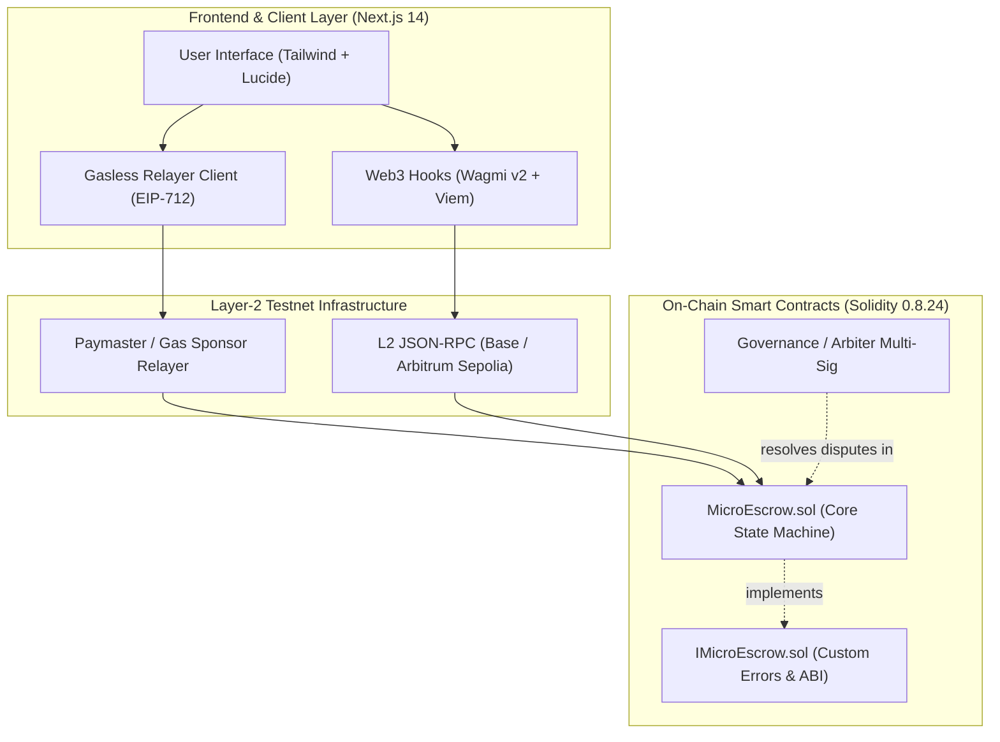
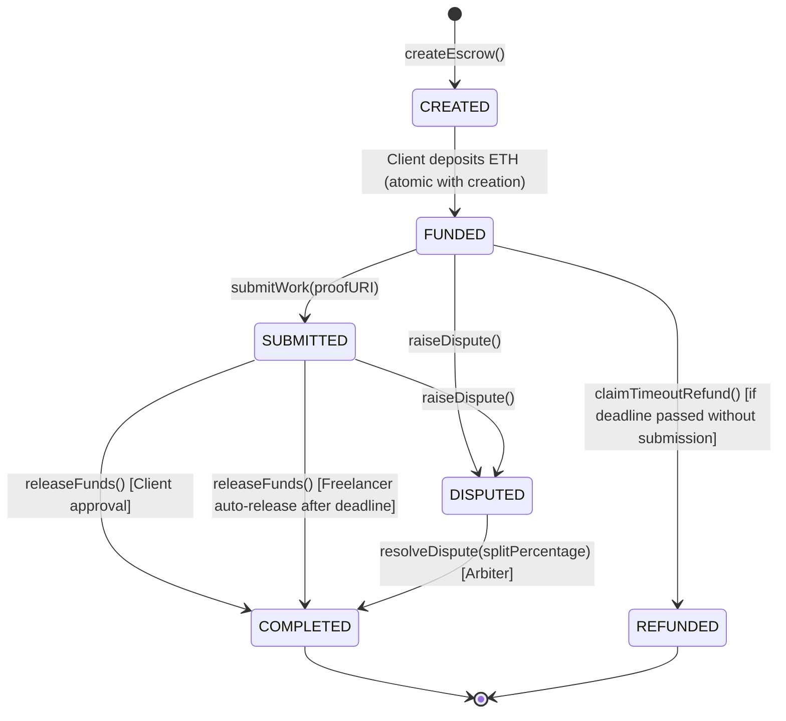
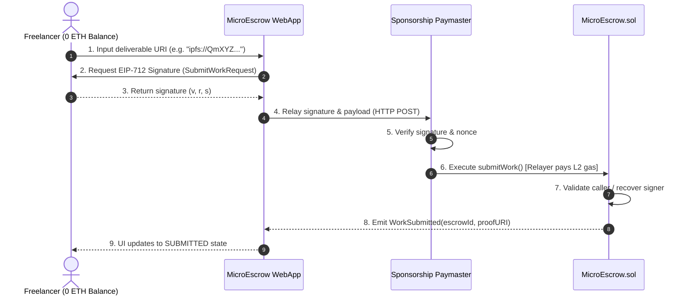
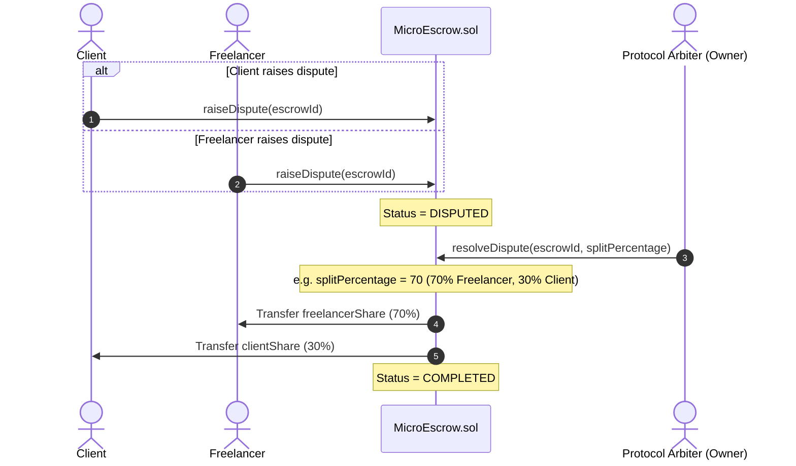

# System Architecture & Technical Specification

## 1. Protocol Overview

**MicroEscrow** is a non-custodial, milestone-based escrow protocol engineered to eliminate counterparty risk in freelance and gig-economy relationships. By combining Ethereum Layer-2 networks with gasless meta-transaction execution, MicroEscrow removes the economic friction that prevents crypto-native onboarding for student freelancers.

---

## 2. High-Level Component Architecture

---

## 3. Finite State Machine (FSM)

The lifecycle of each escrow transaction adheres to a deterministic, non-reentrant state machine:

### State Transitions:
1. **`Created` / `Funded`**: Escrow is created and instantly funded with native ETH via `msg.value`.
2. **`Submitted`**: Freelancer submits deliverable proof (IPFS CID, GitHub PR URL, or documentation hash).
3. **`Completed` (Released)**: Funds are transferred to the freelancer. This occurs either via direct client release OR automated freelancer claim after deadline timeout.
4. **`Disputed`**: Triggerable by either party if deliverables fail requirements or communication breaks down.
5. **`Refunded`**: If deadline passes and the freelancer fails to submit deliverables, the client can reclaim 100% of their deposit.

---

## 4. Sequence Diagrams

### 4.1. Gasless Work Submission (EIP-712 Sponsored Flow)

### 4.2. Dispute Resolution Sequence

---

## 5. Security & Threat Model

| Threat Vector | Mitigation Strategy in MicroEscrow |
| :--- | :--- |
| **Reentrancy Attacks** | Contract inherits OpenZeppelin's `ReentrancyGuard` with `nonReentrant` modifiers applied to `releaseFunds`, `claimTimeoutRefund`, and `resolveDispute`. Follows strict Checks-Effects-Interactions (CEI). |
| **Client Ghosting / Lockup** | Freelancers have guaranteed recourse: if a deliverable has been submitted and the deadline passes without client dispute, the freelancer can directly call `releaseFunds()`. |
| **Freelancer Inaction** | If the deadline passes and `status == Funded` (no work submitted), the client can call `claimTimeoutRefund()` to recover 100% of deposit funds. |
| **Front-running & Griefing** | Only the designated client or freelancer can trigger status mutations on their respective escrows (`UnauthorizedCaller` custom error). |
| **Arithmetic & Splitting Errors** | `splitPercentage` is bounded by `require(splitPercentage <= 100)`. Fractional dust is safely accounted for via standard integer division. |

---

## 6. Gas Optimization Benchmarks (Foundry)

| Function | Execution Gas (avg) | Notes |
| :--- | :---: | :--- |
| `createEscrow` | ~75,000 gas | Initializes storage struct and logs indexed event |
| `submitWork` | ~38,000 gas | Storage update for status & string metadata URI |
| `releaseFunds` | ~45,000 gas | CEI pattern with native ETH transfer |
| `raiseDispute` | ~31,000 gas | Minimal state mutation |
| `resolveDispute` | ~58,000 gas | Performs percentage math and dual ETH disbursements |
